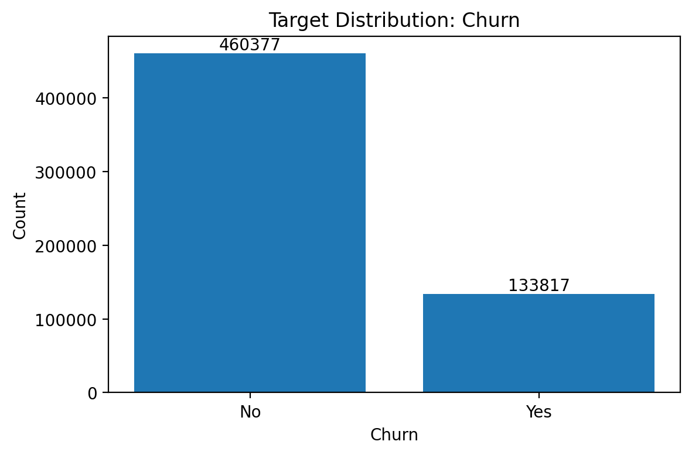
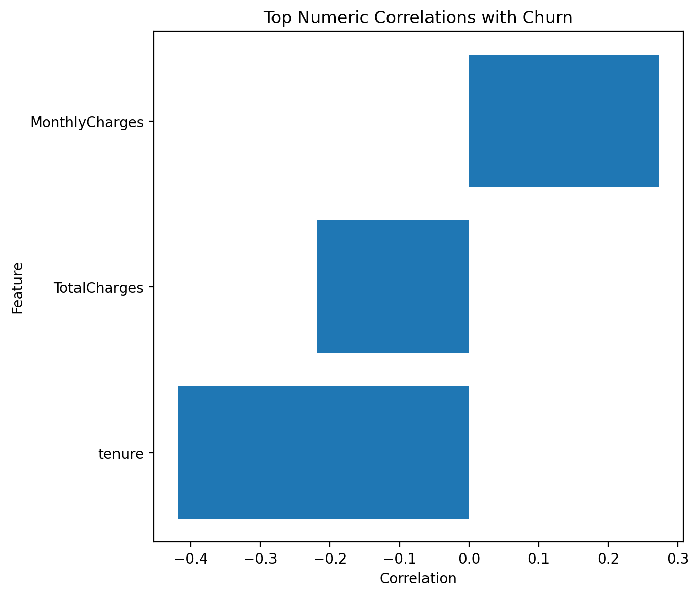
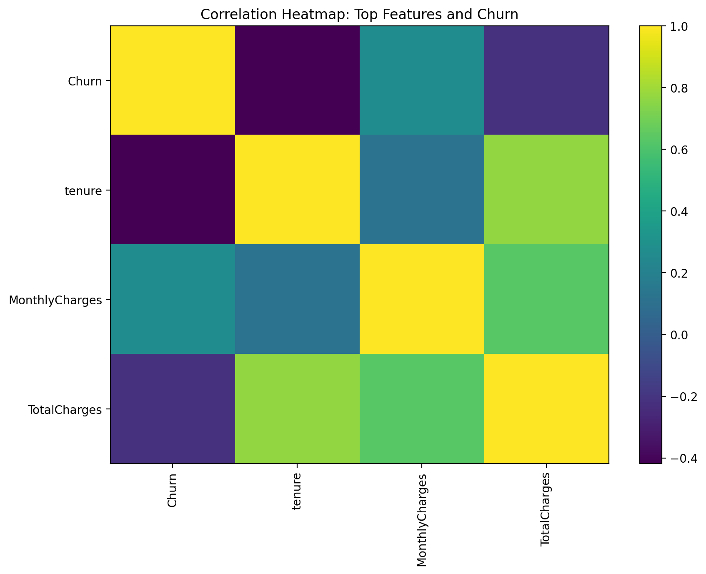

# Predict Customer Churn EDA Report

## 1. 数据概况

本项目为客户流失二分类预测任务，训练集目标变量为`Churn`。当前EDA阶段仅分析数据结构、变量分布、目标变量分布以及训练集与测试集的一致性，不在本阶段提前确定最终模型。

训练集规模为594194行、22列；测试集规模为254655行、20列。识别到的ID字段为：id。

## 2. 目标变量分布

目标变量`Churn`的分布为：No: 460377(77.48%); Yes: 133817(22.52%)。

该结果用于判断客户流失样本是否存在类别不平衡。如果正负样本比例差异较大，后续模型评估不能只看Accuracy，还需要同时关注AUC、F1、Recall、Precision等指标。

## 3. 字段类型

连续数值变量数量为3，类别型或低基数变量数量为16。字段类型划分结果已保存至`tables/feature_summary.csv`。

## 4. 缺失值与重复值检查

训练集与测试集均未发现缺失值。

重复值检查结果已保存至`tables/duplicate_summary.csv`。如果ID字段存在重复，需要进一步判断是否为真实重复客户记录或数据构造方式导致的重复编号。

## 5. 单变量分布

数值变量分布图已保存至`figures/numeric_distributions/`，类别变量分布图已保存至`figures/categorical_distributions/`。该部分主要用于识别偏态分布、异常值、长尾类别以及低频类别。

## 6. 变量与Churn的关系

数值变量与`Churn`的分组统计已保存至`tables/numeric_by_target_summary.csv`，箱线图已保存至`figures/numeric_by_target/`。

类别变量与`Churn`的流失率统计已保存至`tables/categorical_by_target_summary.csv`，流失率图已保存至`figures/categorical_by_target/`。

## 7. 相关性分析

与`Churn`相关性较高的数值变量包括：tenure(-0.4185)、MonthlyCharges(0.2730)、TotalCharges(-0.2184)。

相关性矩阵已保存至`tables/correlation_matrix.csv`，目标变量相关性排序已保存至`tables/target_correlation.csv`。

需要注意，相关性只能反映线性关系，不能直接说明因果关系。若某些变量与`Churn`相关性较低，也不代表其在非线性模型中完全无效。

## 8. 训练集与测试集分布差异

数值变量的训练集-测试集分布差异已保存至`tables/numeric_train_test_shift.csv`，类别变量的新水平与缺失水平检查已保存至`tables/categorical_train_test_shift.csv`。

如果测试集中出现训练集中没有的新类别，后续建模阶段需要使用能够处理未知类别的编码方式，避免提交阶段报错。

## 9. EDA阶段结论

本阶段完成了数据质量、目标变量分布、字段类型、单变量分布、双变量关系、相关性以及训练集-测试集一致性检查。后续建模阶段应以EDA结果为依据，重点关注以下问题：

1. 是否存在类别不平衡；
2. 是否存在缺失值或异常值；
3. 类别变量是否需要编码；
4. 数值变量是否存在明显偏态或极端值；
5. 训练集和测试集是否存在明显分布差异；
6. 模型评价指标不应只依赖Accuracy，应结合AUC、F1、Recall和Precision综合判断。
